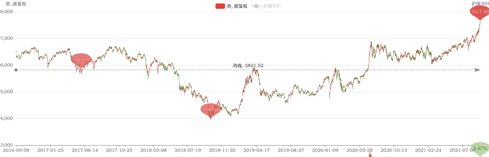
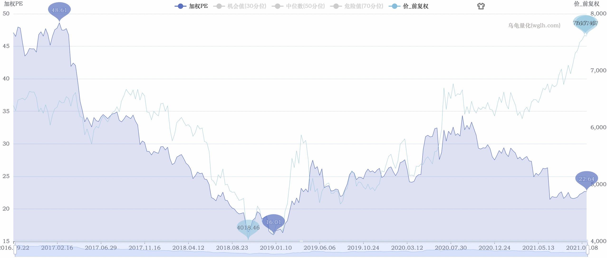
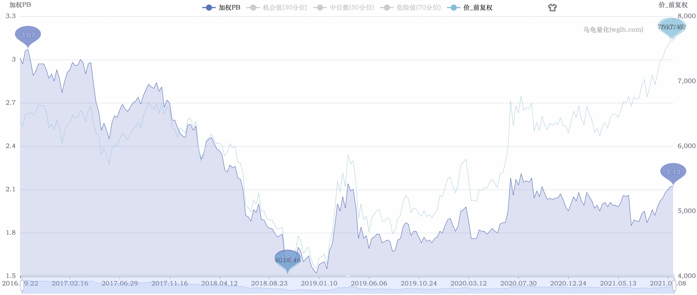
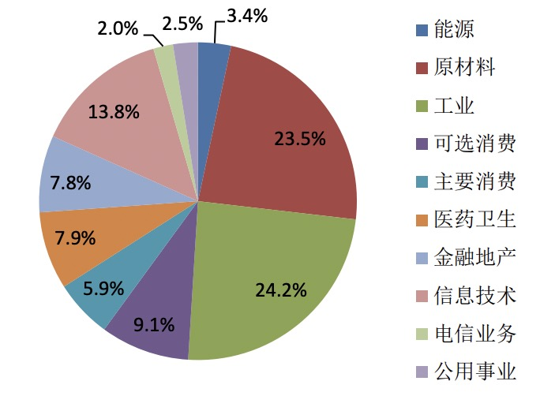

# 2021-09-10-zhongzheng-500

2021年9月10日对【000905 中证500指数】的分析。

## 当前情况

2020-09-09 ～ 2021-09-09 近1年涨幅达到 19.97%。

而目前持有的两个基金【000478 建信中证500指数增强A】和【160119 南方中证500ETF联接(LOF)A 】收益率已经达到18%。

从近5年数据看，指数达到了高位。

PE百分位（近5年）：22.10%

PB百分位（近5年）：60.89%

PB比PE更贴合指数。

## 行业权重分布情况

从[中证指数官网](http://csindex.genius.com.cn/zh-CN/indices/index-detail/000905)目前中证500的成分股情况如下：

可见目前指数的行业分布权重大部分集中在原材料和工业两大板块。

查看这两大板块的相关指数：

* 【930606 中证钢铁】PB百分位（近5年）：97.78%
* 【399440 国证钢铁】PB百分位（近5年）：96.71%
* 【399998 中证煤炭】PB百分位（近5年）：97.37%
* 【000819 有色金属】PB百分位（近5年）：99.92%

可见着两大板块的PB已经达到相当高位。

## 结论

从PE看是低估，但是从PB看处于适中位置，但是这个PB很可能是因为原材料和工业两大板块的顶上去的，而这两大块的PB已经到顶了，也就是说后期行情无以为继。

本轮中证 500行情即将到达顶点，不易再跟进，卖出一部分1/3观望，等待时机卖出。

