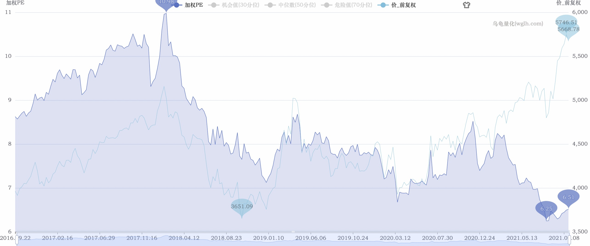
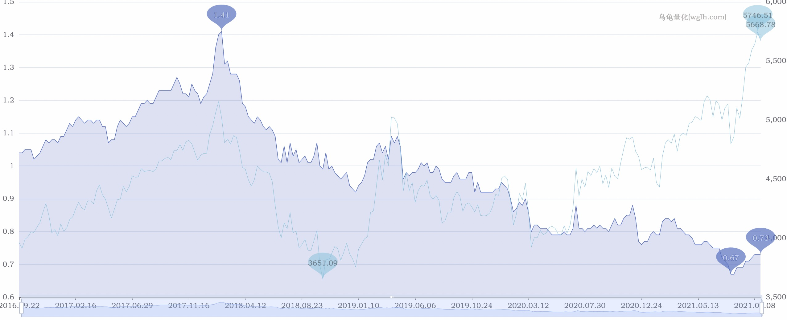

2021年9月11日对【000922 中证红利指数】的分析。

## 当前情况

近1年涨幅达到 27.15%。

从近5年数据看，指数达到了高位。

PE百分位（近5年）：2.88%

PB百分位（近5年）：3.62%

## 行业权重分布情况

从该指数的成分股情况如下：

## <del>结论（错误）</del>

从PE、PB双低估，可以投入。

策略如下：

* 买入 【090010 大成中证红利指数A】，【100032 富国中证红利指数增强A】，两者投入金额1:1。
* 分 5 次投入，每次额度A，总金额 = 5 * A。
* 投入间隔，1个月。
* 临时加投：如果下跌超过4%，临时加投 0.5 * A 。
* 暂停投入：估值处于正常区时。

## 修正结论 2021-09-14更新

从PE看，发生了PE往下走，指数往上走的情况，这是因为中证红利指数的个股是以股息加权的，不是以市值加权计算的，而乌龟量化是以市值对个股加权的，上面的图是失真的。

从[中证红利官网](http://www.csindex.com.cn/zh-CN/indices/index-detail/000922)下载估值表，看【市盈率2（计算用股本）P/E2】，PE已经达到12.3。

因为没有历史数据参考，无法知晓该值所处于的历史百分位。因此通过参考绝对值来判断，10 < PE < 15，停止买入，正常持有，当该 PE >= 15 时卖出。

参考文章：

* [为什么指数上涨，估值却下降？红利指数估值到底怎么看？](https://www.jisilu.cn/question/437213)
* [怎么判断指数基金便宜到可以买入了](https://www.jisilu.cn/question/364447)

