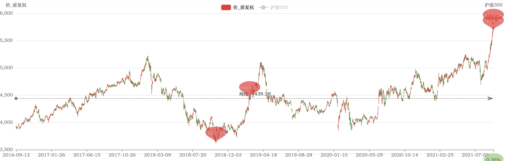
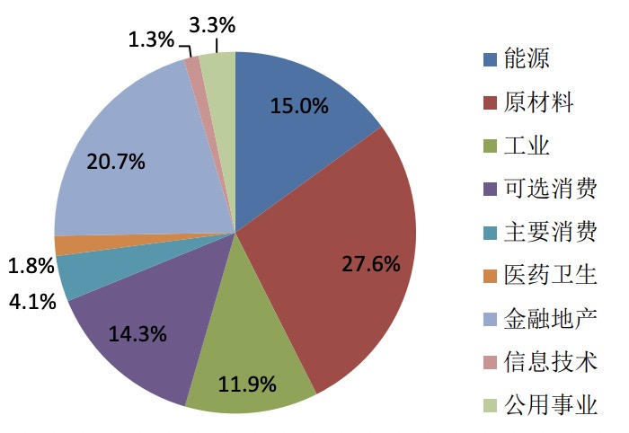

2021年9月11日对【000922 中证红利指数】的分析。

## 当前情况

近1年涨幅达到 27.15%。

从近5年数据看，指数达到了高位。

PE百分位（近5年）：2.88%

PB百分位（近5年）：3.62%

## 行业权重分布情况

从该指数的成分股情况如下：

## 结论

从PE、PB双低估，可以投入。

策略如下：

* 买入 【090010 大成中证红利指数A】，【100032 富国中证红利指数增强A】，两者投入金额1:1。
* 分 5 次投入，每次额度 A，总金额 = 5 * A。
* 投入间隔，1个月。
* 临时加投：如果下跌超过4%，临时加投 A。
* 暂停投入：估值处于正常区时。
