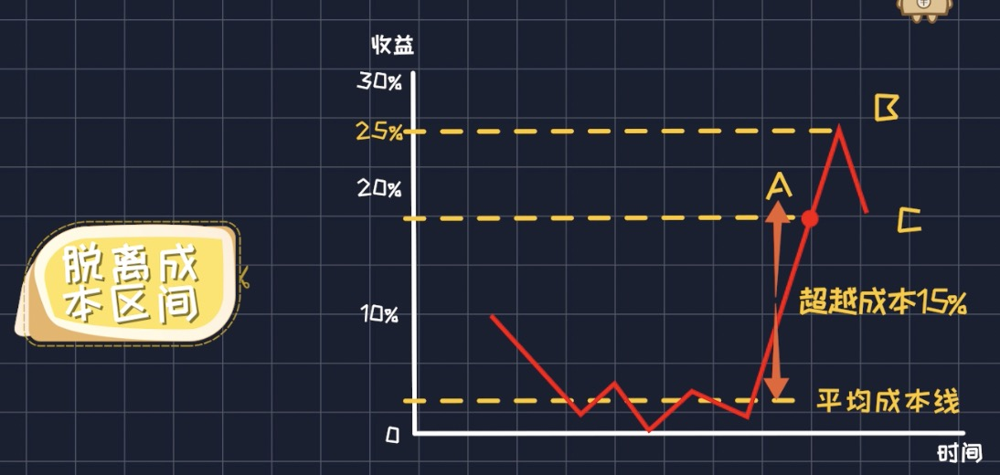
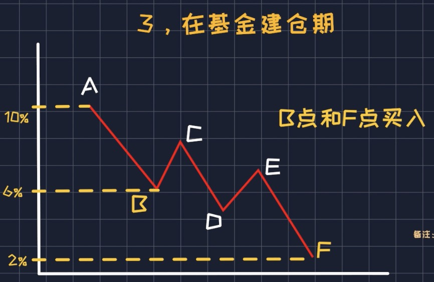
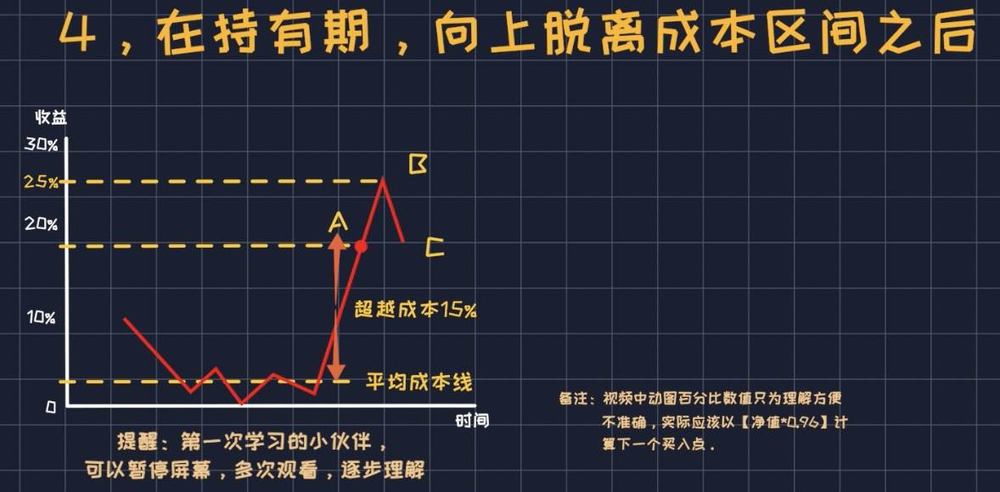

# 4%投资法

本方法来自于这个[B站视频][1] 05:41 位置。姑且听之。

本方法适合有几个局限性：

* 只适合主动型股票基金，这类基金的估值不太好判断，因为基金经理会调仓。
* 不适合指数基金，因为指数基金你只要在低估值区域买入就行了，随便定投还是不定投。
* 对于下跌行情有好处，主要解决下跌行情中在累积份额和降低持有成本间达到平衡，使你在上涨时更快回血。

**名词介绍：**

建仓期：仓位到仓位买足。

持有期：保持仓位等待上涨，在该期间买入叫做加仓 or 补仓。

脱离成本区间：基金上涨目前收益远高自己的成本，一般定为15%以上。

**步骤**

1. 选择业绩长期优秀的基金

2. 总金额分成10份

3. 建仓期策略：每当从上一个最低点下跌超过4%，那么就买入一次

   

4. 持有期策略：**在向上脱离成本区间之后**，从最高点净值下跌4%，加仓一次。

   

[1]: https://www.bilibili.com/video/BV1gQ4y1r71v

