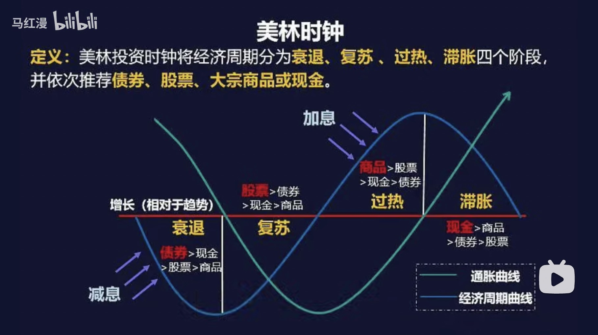

# 股债均配

> 实际上不一定要完全均配，根据情况可以股多点债少点，也可以债多点股少点
> 
> 一定要管住手，不要主动调整，一定要按照客观情况调整

## 概述股

债均配是一种资产配置策略：

* 股债比例并非定死50%债，50%股，根据具体情况可以债多一点，或者股多一点（下面说—）
* 动态保持比例：
  * 股票不好的时候，把债的收益挪到股票中，摊薄股票成本
  * 股市大跌的时候，挪一部分债到股票中，等待股市回春
* 债券投资
  * 债基收益都差不多
  * 债券风险低但也有暴雷可能
  * 分散投资10个债基
* 股票投资：
  * 股的部分，两大股票组合：沪深300、创业板指数
  * 任一品种设置最高仓位，一般10%，就算你再看好这个行业，也不能超过15%
  * 分散投资

平衡策略：

* 90%的情况下，一年定期平衡一次，比如每年12月31号
* 如果遇到股市大跌，超过20%，或者达到 6:4 这样的比例，可以主动平衡一次
* 如果遇到股市大涨，不建议主动平衡，因为可能会错过牛市上涨的福利

## 配比策略

80% 仓位 beta 收益，20% 仓位 alpha 收益。

### 80% 仓位：beta 收益

这部分资金按照自上而下的逻辑配置。

**第一层：决定股债比例**

自上而下，根据美林时钟决定股和债的比例。

2022年根据中国经济的判断：从衰退走向复苏，而因为俄乌冲突导致全世界通货膨胀，导致又有一点滞胀的环节，从大的逻辑上讲是从衰退走向复苏。

**第二层：决定沪深300、创业板比例**

再一般三年大盘（沪深300，也就是所谓价值股）、三年小盘（创业板，也就是所谓的成长股），根据当前情况调整沪深300和创业板的比例。

后面三层不用关心，只要前两层就好了。：

* 第三层：4大领域：金融、消费、周期、成长
* 第四层：具体行业
* 第五层：具体个股

### 20% 仓位：alpha 收益

根据宏观经济、宏观政策、财政政策、货币政策，找到一些具有机会的周期性板块。

比如2022年的基建、2022年的中概互联等等。

## 资料

* [合适做股债平衡][1]
* [股债均配到底怎么配置？][2]

[1]: https://www.bilibili.com/video/BV1eY411E799?t=489
[2]: https://www.bilibili.com/video/BV1eZ4y187be?t=381