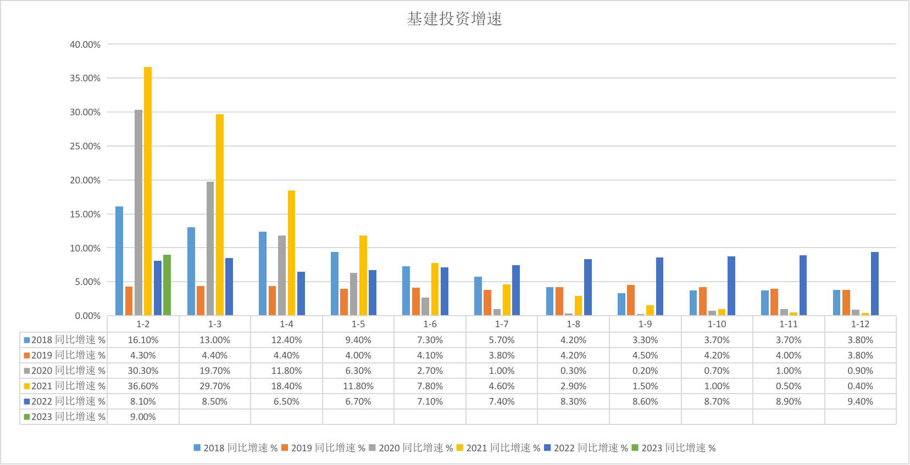

# 基建投资增速数据怎么看

## 历史数据分析

看下面这张图：

可以发现与同比增速相关的一个很明显的规律：

* 如果高开低走（一开始很高，后面递减），那么到年底一统计，全年的增速就低，例子 2018、2020、2021
* 如果走势始终比较平稳，那么到年底一统计，全年的增速也不差，例子 2019、2022  
* 后者的趋势优于前者的趋势

所以可以推导出：

* 基建投资，上半年投资绝对数占全年的比例较低，就算同比增速很高，也无法影响全年的大局，最典型的就是 2021 年

## 挑选指数

挑选了下面这个指数，对指数与PE/PB的相关性分析结果：

|                | PE_TTM_加权                    | PE_TTM_等权 | PB_TTM_加权   | PB_TTM_等权  | 股息收益率 % | ROE %   | 最早数据日期  |
|----------------|--------------------------------|-----------|---------------|-------------|-------------|---------|------------|
| 399995_基建工程 | 0.9811 | 0.9029    | 0.9709        | 0.9531      | -0.9121     | 0.6383  | 2015-01-05  |

可以看到指数和【PE-TTM-加权】的相关性最高，高达 98.11%，【PB-TTM-加权】也不低，高达 97.09%。

说明我们可以通过这两个指标来判断基建是否处于估值低位，来确定是否具有投资机会。

## 投资建议

如果你已经入手了基建类指数，那么：

* 至少要看到 1 - 6 月份数据是否平稳
* 如果平稳，那么到年底就基本稳了，再结合【PE-TTM-加权】估值来看，决定是否抛出变现
* 如果明显衰减，那么到年中就可以抛出变现了

如果还没有入手基建指数，那么：

* 看基建的【PE-TTM-加权】估值，逢低布局
* 同时关注国家基建政策，寻找确定性机会，以免买是买的低了，但是国家没有计划对基建投资发力，导致长期没有收益
