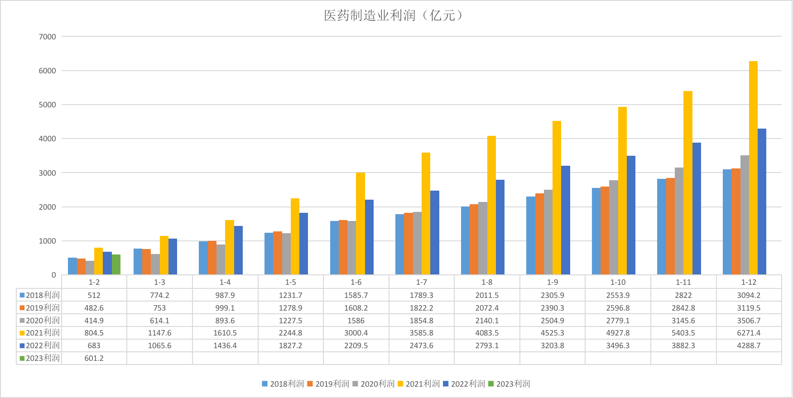
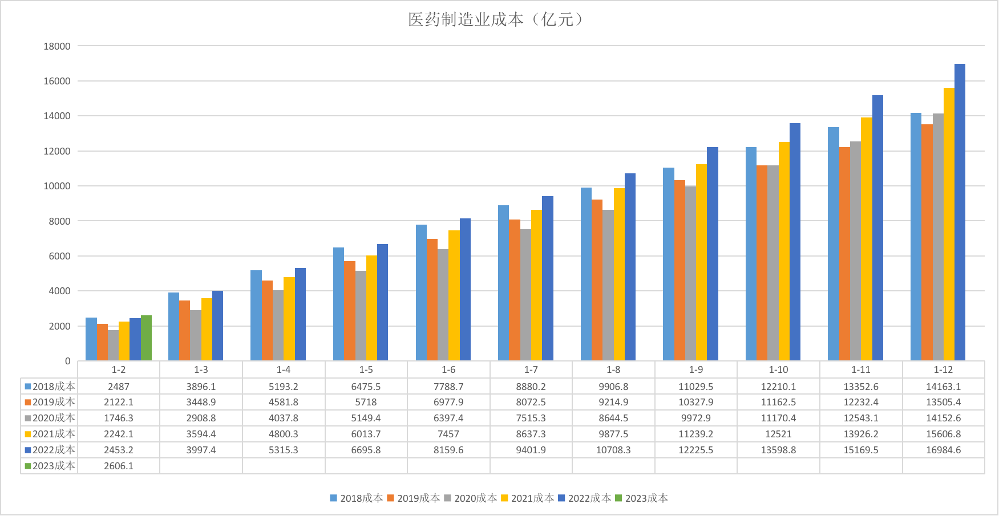
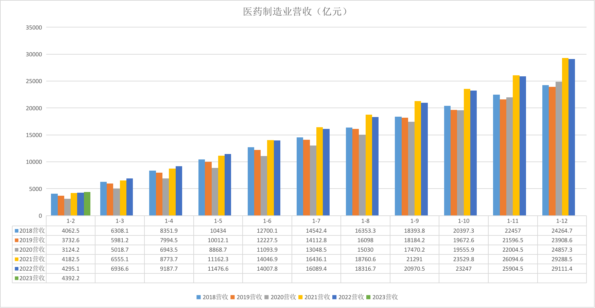
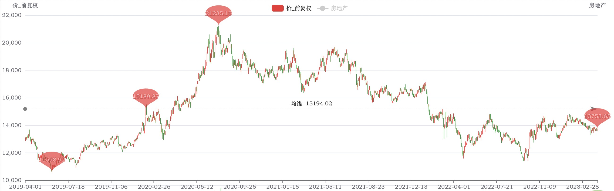
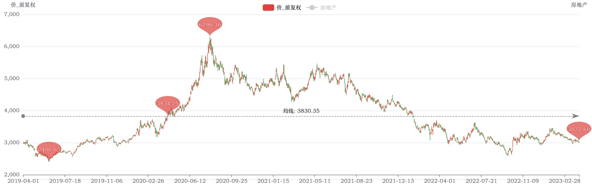

# 2023年医药行业投资机会分析

## 工业利润数据

医药制造业利润数据

医药制造业成本数据

医药制造业利润营收数据

数据分析：

| 指标    | 18-20年  | 21年  | 22年  |
|--------|----------|-------|------|
| 利润    | 稳步增长 | 大爆发 | 回落明显，但依然明显高于20年水平 |
| 成本    | 呈收缩趋势 | 抬升明显 | 进一步抬升 |
| 营收    | 呈收缩趋势 | 抬升明显 | 和21年持平 |

## 大事件

### 疫情事件

相关事件（1）[中国新冠时间线](https://zh.wikipedia.org/wiki/2019%E5%86%A0%E7%8A%B6%E7%97%85%E6%AF%92%E7%97%85%E4%B8%AD%E5%9B%BD%E5%A4%A7%E9%99%86%E7%96%AB%E6%83%85%E6%97%B6%E9%97%B4%E8%BD%B4)：

* 2020年上半年大规模爆发
* 2020年6月 - 2021年3月散点爆发
* 2021年3月 - 2022年3月大规模疫苗接种
* 2022年3月 - 2022年11月第二次大规模爆发
* 2022年11月 - 2023年2月第三次大规模爆发（主动放开的结果），同时社会面开始囤药，一药难求现象出现

结合2021年利润大爆发，2021年全国开启大规模的疫苗接种。

虽然 2022年12月～2023年2月 发生了囤药风波，但是从2023年1-2月利润数据来看，似乎并没有贡献超额利润，三个可能性：

* 企业在藏利润
* 去的是经销商的库存，对药厂没有什么影响
* 只是少部分地区在囤药，新闻炒的比较热，总体基本面不变

### 医药集采

|  批次  |  年度   | 品种  | 产品 |  企业  |  链接   |
|-------|---------|------|------|-------|----------|
| 1     | 2019-9  | 25   | 60   | 45    | [链接][j1] |
| 2     | 2020-1  | 32   | 100  | 77    | [链接][j2] |
| 3     | 2020-8  | 55   | 191  | 125   | [链接][j3] |
| 4     | 2021-2  | 45   | 158  | 118   | [链接][j4] |
| 5     | 2021-6  | 61   | 251  | 148   | [链接][j5] |
| 6     | 2021-11 | 16   | -    | 11    | [链接][j6] 胰岛素专场 |
| 7     | 2022-7  | 60   | 327  |       | [链接][j7] |
| 8     | 2023-3  | 39   | 252  | 174   | [链接][j8] |

结合2021年利润大爆发，当年历史性的举行了3批次的集采，然后2022年的利润就回落明显了。

其实撇开2021年看，集采其实并没有打压医药行业的利润，它们的利润还是稳步增长的，集采坚决打击的是过分的超额利润，所以2021年来了3波，2022年就回归合理水平了。

[j1]: https://www.smpaa.cn/gjsdcg/2019/09/24/9014.shtml
[j2]: https://www.smpaa.cn/gjsdcg/2020/01/17/9260.shtml
[j3]: http://www.gov.cn/xinwen/2020-08/20/content_5536269.htm
[j4]: http://www.gov.cn/xinwen/2021-02/03/content_5584689.htm
[j5]: http://www.gov.cn/xinwen/2021-06/23/content_5620452.htm
[j6]: http://www.gov.cn/xinwen/2021-11/28/content_5653836.htm
[j7]: http://www.gov.cn/xinwen/2022-07/12/content_5700687.htm
[j8]: http://cpc.people.com.cn/n1/2023/0330/c64387-32654060.html

## 挑选指数

### 第一轮筛选

和医药行业相关的指数有以下这些，以及它们的指数与PE/PB的相关性分析结果：

|                   | PE_TTM_加权  | PE_TTM_等权 | PB_TTM_加权                       | PB_TTM_等权                   | 股息收益率 % | ROE %   | 最早数据日期     |
|-------------------|-------------|-----------|---------------------------------|---------------------------------|---------|---------|------------|
| 000933_中证医药     | 0.6724     | 0.3937    | 0.7136 | 0.1275 | -0.5564 | -0.0836 | 2012-01-04 |
| 399394_国证医药     | 0.5819     | 0.2904    | 0.7755 | 0.4028 | -0.4065 | 0.4538 | 2012-10-29 |
| 000913_300医药     | 0.8842     | 0.7570     | 0.9209 | 0.7095 | -0.7258 | 0.0288 | 2012-01-04 |
| 930726_中证生物医药 | 0.5099     | 0.1308     | 0.8574 | 0.0166 | -0.1400 | 0.1408 | 2015-08-06 |
| 399441_国证生物医药  | 0.1938     | 0.2683     | 0.7045 | 0.5920 | -0.3444 | 0.4697 | 2015-01-21 |
| 000991_全指医药     | 0.5807     | 0.2906     | 0.5525 | 0.0244 | -0.3897 | -0.2374 | 2012-01-04 |
| h30255_500医药     | 0.3462     | 0.4112     | 0.4178 | 0.2754 | -0.0883 | 0.0904 | 2013-11-07 |
| 000978_医药100     | 0.7468     | 0.5886     | 0.8209 | 0.5004 | -0.5570 | 0.2010 | 2012-01-04 |
| 931484_CS医药创新   | 0.6573     | 0.5310     | 0.9166 | 0.5581 | -0.8651 | -0.1169 | 2020-05-07 |

先根据年限（ > 5年）、指标相关性程度（ > 0.8），初选：

* 000913_300医药
* 930726_中证生物医药
* 000978_医药100

因为年限长，估值数据才有参考意义；相关度高，才能通过指标来判断当前是否处于估值低位。

### 第二轮筛选

我们要找一个行业匹配度高的指数，只有这样才能通过分析医药制造业的工业利润来判断指数的趋势。

再查看成分股行业匹配度，根据 [国民经济行业分类标准（GB/T4754-2017）][in-cat]，“医药制造业” 相关的子行业有：

* 化学药品原料药制造
* 化学药品制剂制造
* 中药饮片加工
* 中成药生产
* 兽用药品制造
* 生物药品制品制造
  * 生物药品制造
  * 基因工程药物和疫苗制造
* 卫生材料及医药用品制造
* 药用辅料及包装材料制造

而 “医疗仪器设备及器械制造”及其子分类 归属到 “专用设备制造业” 里，所以它的利润是归属到 “专用设备制造业” 里的。

000913_300医药 的成分股行业权重（数据来源于乌龟量化）：

| Sector - 行业	| 汇总 |
|--------------|------|
| 化学制药	| 20.88 |
| 美容护理	| 4.23 |
| 生物制品	| 19.7 |
| 医疗服务	| 30.41 |
| 医疗器械	| 12.17 |
| 中药	| 12.59 |
| 总计	| 99.98 |

可以看到 非医药制造业（医疗服务、美容护理）占 34.64% 太高。

000978_医药100 的成分股行业权重：

| Sector - 行业	| 汇总 |
|--------------|------|
| 化学制药  | 21.35 |
| 美容护理	| 1.13 |
| 生物制品	| 21.04 |
| 医疗服务	| 14.47 |
| 医疗器械	| 21.64 |
| 医药商业	| 7.54 |
| 中药	   | 12.88 |
| 总计	   | 100.05 |

可以看到 非医药制造业（美容护理、医疗服务、医药商业）占 23.14%，较低。

930726_中证生物医药 的成分股行业权重：

| Sector - 行业	| 汇总 |
|--------------|------|
| 化学制药	| 19.02 |
| 生物制品	| 38.24 |
| 医疗服务	| 19.15 |
| 医疗器械	| 21.17 |
| 中药	    | 2.4 |
| 总计	   | 99.98|

可以看到 非医药制造业（医疗服务）占 19.15%，较低。

根据上面的分析，第二轮筛选出：

* 930726_中证生物医药
* 000978_医药100

### 第三轮筛选

再看这两个指数的当前估值位置：

* 930726_中证生物医药 PB加权相关系数 0.8574，当前百分位 2.15%（近10年）。
* 000978_医药100 PB加权相关系数 0.8209，当前百分位 12.22%（近10年）。

两者都在低位，处于投资机会种。

### 第四轮筛选

好了，现在选出两个指数，它们：

* 成分股行业相关度高（大部分是医药制造业）
* PB加权 和指数本身趋势的相关性都比较高
* 根据近 10 年数据的分析，当前处于估值低位，具有投资机会

现在再看看它们指数趋势和“国家统计工业企业利润”的相关性高不高？

如果不高，那么“工业企业利润”这个数据也不足指导对这两个指数的投资。

下面通过目测来观察，取2019年4月1日 - 2023年的 K线 ：

医药100-k线：

中证生物医药-k线：

发现两者趋势大体相同，但是有一个奇怪的地方2020年的时候，都有一波大行情。

明显和基本面背离，因为工业利润数据是在2021年才大爆发的，2020年压根就没有什么特别高的利润增长。

观察这两个指数的历史估值（这里不截图了，可以在乌龟量化里看到），2020年估值炒地特别高。

同年 葛兰 作为医药女神出圈了，那么这里可以推出一个结论：

* 2020年的医药行情纯粹是市场炒作上去的，完全脱离基本面，这波行情在2020年中达到最高峰
* 炒作过后，应该痛跌，但因2021年医药行业利润大爆发，基本面撑了一下，续命了一下
* 2022年 基本面回归，导致大跌，而且还跌过头，医药行业一蹶不振至今

## 结论

机会方面：

* 2023年基本面 可能和2022年持平，大概率会大于 2020 年，极小概率达到2021年水平。
* 2023年这两个指数目前处于历史低位，具有投资价值：
  * 930726_中证生物医药，PB加权 百分位 2.15%（近10年）
  * 000978_医药100，PB加权 百分位 12.22%（近10年）
* 不用太担心集采，集采不会打击医药行业的发展。

风险方面：

* 2022年12月～2023年2月因放开导致的囤药风波对2023年业绩会有多少影响犹未可知。
* 2022年的业绩比2020年高很多，有多大因素是因为疫情导致的。是否会随着2023年疫情的大缓解而收缩，即2023年业绩是否会比2022年差很多。

综合考虑：可以投资 930726_中证生物医药 指数，及其对应的 512290 生物医药ETF。

000978_医药100 没有 ETF，本人不喜欢，所以不投资。

[in-cat]: http://www.stats.gov.cn/sj/tjbz/gmjjhyfl/