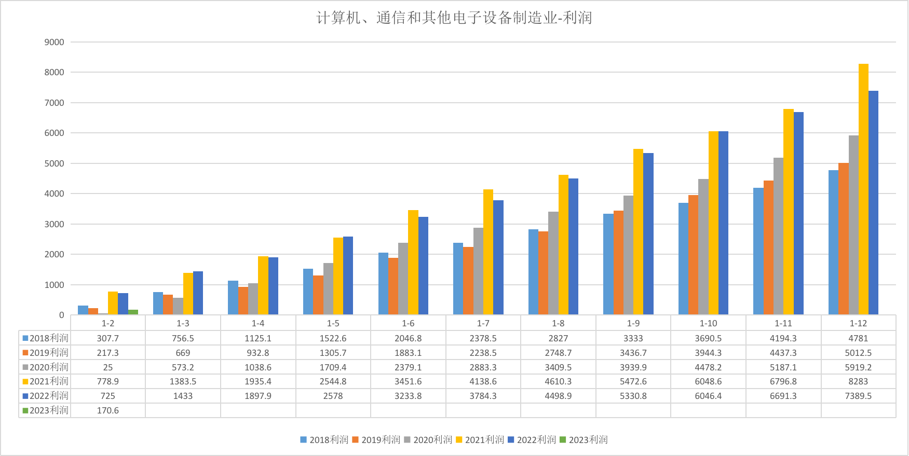
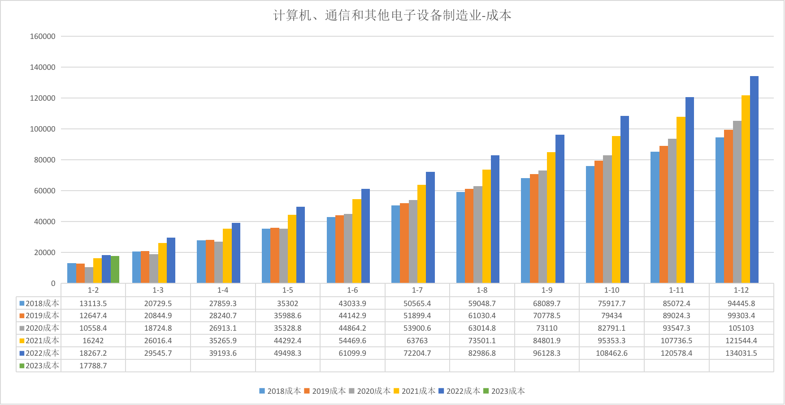
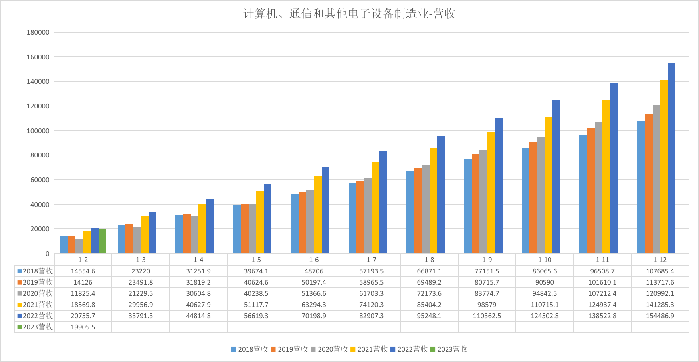

# 2023年半导体行业投资机会分析

日期：2023-04-07

## 工业利润数据

计算机、通信和其他电子设备制造业 利润数据

计算机、通信和其他电子设备制造业 成本数据

计算机、通信和其他电子设备制造业 营收数据

数据分析：

|        | 利润(同比增速)               | 成本(同比增速) | 营收(同比增速)       |
|--------|----------------------------|--------------|------------|
| 2018   |  -3.1%                     |  +9.4%       | +9.1%     |
| 2019   |  +3.1%                     |  +4.2%       | +4.5%      |
| 2020   |  +17.2%                    |  +8.1%       | +8.3%      |
| 2021   |  +38.9%                    |  +13.7%      | +14.7%     |
| 2022   |  -13.1%，但仍比20年 +24.8%   |  +6.2%       | +5.5%     |

2018 - 2022年，半导体行业整体处于扩张趋势，营收、利润双增长，同时投入（成本）也在增长。

2020年08月04日 国家发布了 [《新时期促进集成电路产业和软件产业高质量发展的若干政策》][p1]，
也许可以解释为何2020年利润小跳跃，2021年的利润大跳跃。

## 指数

选择指数：H30184_半导体，年限 2013-07-16，PB加权相关性 0.9235，当前PB加权百分位 74.57% 。

## 结论

当前半导体估值太高，市场情绪过热，不宜入场。

但是依然看好半导体行业的发展，因为从2018年起，整体行业处于扩张趋势，随着国家的支持以及国产化进程的不断推进，半导体行业会越来越好。

[p1]: http://www.gov.cn/zhengce/content/2020-08/04/content_5532370.htm
