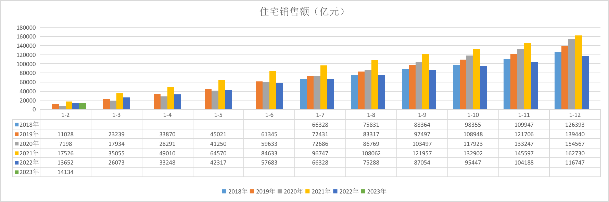
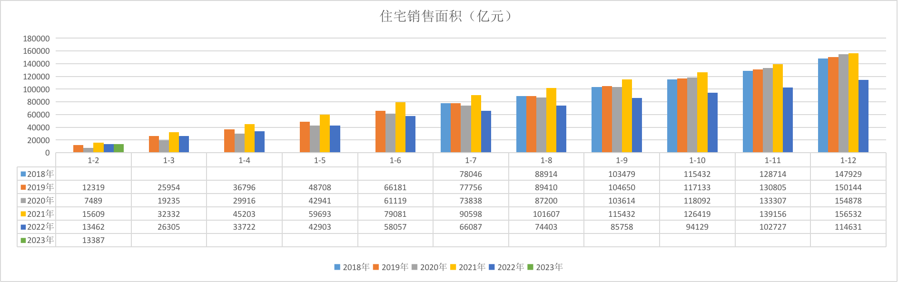
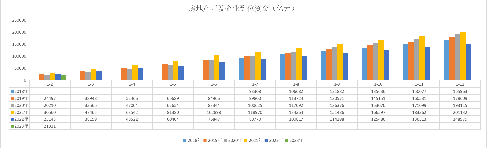
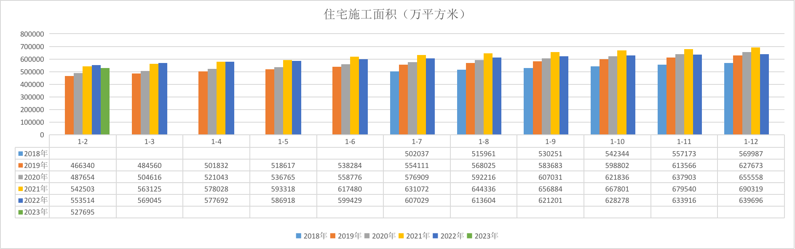
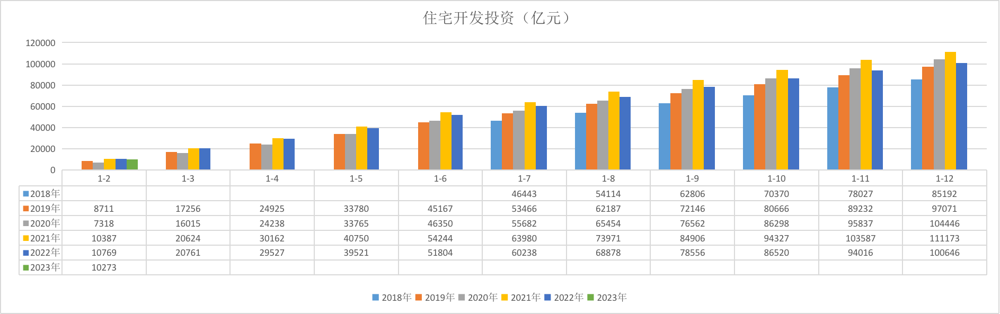
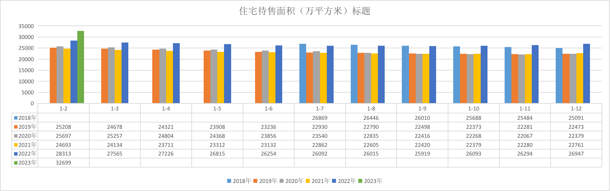
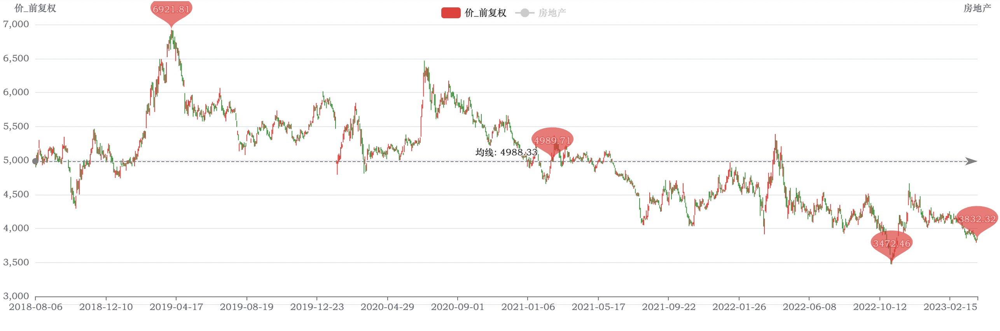

# 2023年房地产投资机会

日期：2023-04-03

收集了 2018 年 - 2023 年的全国房地产投资数据。

## 销售数据

先说结论：从2018年开始（除2022年）：

* “住宅销售额” 和 “销售面积” 稳步增长
* “住宅销售额” 增幅大于 “销售面积”，意味着面积单价在涨
* “房地产企业到位资金” 的增长趋势和 “销售额” 基本一致

再看2022年：

* “住宅销售额” 和 “房地产企业到位资金” 略低于 2018 年
* “住宅销售面积” 远低于 2018 年，也意味着面积单价相对于 2022 年涨的挺多

> 销售额和销售面积都是代表已销售。

## 投资数据

先说结论：

* 2022 年的 “住宅施工面积” 和 “住宅开发投资” 都有显著的下滑，仅略高于 2019 年数据。
* 也就是说 2022 年住宅房地产的投资都产生了明显下滑

## 库存数据

先说结论：

* 2022 年的 “住宅待销售面积” 相比 2021 年有明显的库存计划情况
* 同时 2023 年 1-2 月份的库存为历史最高

## 指数数据

看 [931775 中证房地产指数](https://wglh.com/chinaindicesprice/csi931775/)，2018年8月 ~ 2021年底，整个指数回撤了 -22%。

从 2019年4月最高点 到 2022年11月最低点，回撤接近 50% 左右。

而从 2022年4月疫情爆发 到 2022年底，总共回撤了 22% 左右。

从指数上看，指数的趋势呈现总体向下的趋势，和基本面出现了明显的背离。

资本市场可能会一时间脑子抽风，但是长达数年的背离应该肯定是有逻辑在的。

从逻辑上推理应该是 **利润的下滑** 导致了指数的下行。

## 结论

从 2018 年 ～ 2021 年整体看：

* 房地产的投资、销售 2018 年～2021年，都是趋势上涨的。
* 库存 2018 年比较高，2019年～2021年，是比较稳定的

而 2022 年里：

* 投资 退回到 2019 年水平
* 销售 退的比较厉害，低于 2018 年水平
* 库存 则比 2018 年还高

自 2017年10月18日国家提出“房住不炒”以来，从数据上看，如果没有2022年的疫情影响，投资、销售方面都是一个向上的趋势的。

预计随着 2023年疫情影响的消失，投资和销售数据将回稳提升，至少回到 2019 年水平应该问题不大。

自2017年10月18日国家提出“房住不炒”以来，房地产企业的利润在逐步下滑，到了 2022 年受疫情影响更是一塌糊涂。

从指数方面来看，同时目前房地产的 PB加权处于 5% 以下极低的位置。

所以，2023 年会存在较大概率估值修复可能，具有一定的投资机会。

