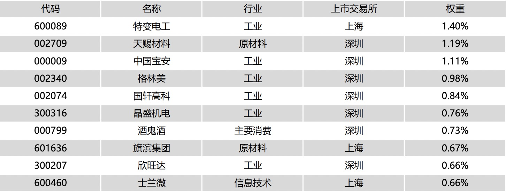

## 沪深300

沪深300指数 000300（[官网](http://www.csindex.com.cn/zh-CN/indices/index-detail/000300)）是上交所和深交所Top300家大中型企业，综合反映A股市场大中型公司的股票价格表现。

**更新周期**

成分股每年6月和12月的第二个星期五的下一交易日会进行调整，排名靠后的公司会和中证500排名靠前的公司进行轮换。

**行业分布**

**十大权重股**

## 中证500

中证500指数 000905（[官网](http://www.csindex.com.cn/zh-CN/indices/index-detail/000905)）是上交所和深交所规模301-800的中小企业，综合反映A股市场中小市值公司的股票价格表现。

**更新周期**

每年6月和12月的第二个星期五的下一交易日会进行调整，排名靠前的公司会和沪深300排名靠后的公司进行轮换。

**行业分布**

**十大权重股**

## 上证50

上证50指数 000016 （[官网](http://www.csindex.com.cn/zh-CN/indices/index-detail/000016)）是由上交所 过去一年的日均总市值、日均成交金额进行综合排 名，选取排名前 50 位的证券组成样本。

**更新周期**

每年6月和12月的第二个星期五的下一交易日会进行调整，排名靠前的公司会和沪深300排名靠后的公司进行轮换。

**行业分布**

**十大权重股**

## 中证红利

中证红利指数 000922（[官网](http://www.csindex.com.cn/zh-CN/indices/index-detail/000922)）是在沪深300的样本空间中，选取100只现金股息率高、分红比较稳定、具有一定规模及流动性股票作为成分股，采用股息率作为权重分配依据。

**更新周期**

每年调整一次，样本调整实施时间为每年 12 月的第二个星期五的 下一交易日。

**行业分布**

**十大权重股**

