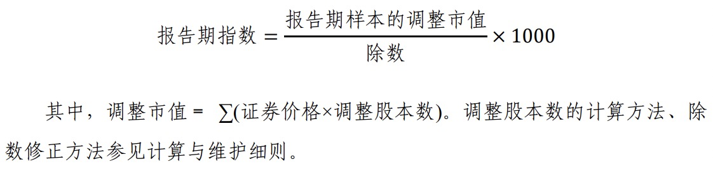

## 000300 沪深300

沪深300指数 000300（[官网](http://www.csindex.com.cn/zh-CN/indices/index-detail/000300)）是上交所和深交所Top300家大中型企业，综合反映A股市场大中型公司的股票价格表现。

**样本更新周期**

成分股每年6月和12月的第二个星期五的下一交易日会进行调整，排名靠后的公司会和中证500排名靠前的公司进行轮换。

**计算方式**

指数计算中的调整股本数系根据 *分级靠档* 的方法对样本股本进行调整而获得。要计算调整股本数，需要确定 *自由流通量* 和 *分级靠档* 两个因素。

**自由流通量**

沪深 300 指数剔除了上 市公司股本中的限售股份，以及由于战略持股或其他原因导致的基本 不流通股份，剩下的股本称为自由流通股本，也即自由流通量。

* 公司创建者、家族、高级管理者等长期持有的股份；
* 国有股份；
* 战略投资者持有的股份；
* 员工持股计划。

上市公司公告明确的限售股份和上述四类股东及其一致行动人 持股达到或超过 5%的股份，被视为非自由流通股本。

* 自由流通量 =样本总股本 - 非自由流通股本

**分级靠档**

中证指数有限公司在计算沪深 300 指数时，采用分级靠档的方法， 即根据自由流通量所占样本总股本的比例（即自由流通比例）赋予总股本一定的加权比例，以确保计算指数的股本保持相对稳定。

* 自由流通比例 = 自由流通量 /样本总股本
* 调整股本数 =样本总股本× 加权比例

**行业分布**

**十大权重股**

## 399006 创业板指

创业板指数 399006 （[官网](http://www.cnindex.com.cn/module/index-detail.html?act_menu=1&indexCode=399006)）由深市创业板中市值大、流动性好的100只股票组成，反映创业板市场的运行情况。

**样本更新周期**

每年6月和12月的第二个星期五的下一交易日。

选样方法：

* 首先，计算入围选样空间股票在最近半年的 A 股日均总市 值和 A 股日均成交金额； 

* 其次，对入围股票在最近半年的 A 股日均成交金额按从高 到低排序，剔除排名后 10%的股票； 

* 然后，对选样空间剩余股票按照最近半年的 A 股日均总市值从高到低排序，选取前 100 名股票构成指数样本股。

**计算方式**

该指数反映所有100只股票的总体涨跌情况。

样本股权数：为样本股的*自由流通量*，分子项和分母项的 权数相同。

自由流通量：上市公司实际可供交易的*流通股数量*，它是 *无限售条件股份* 剔除“持股比例超过 5%的下列三类股东及其一致行动人所持有的无限售条件股份”后的*流通股数量*：①国有 （法人）股东；②战略投资者；③公司创建者、家族或公司高管人员。

自由流通市值：*股票价格* 乘以 *自由流通量*。

分子项：为样本股实时自由流通市值之和。

分母项：为样本股上一交易日收市自由流通市值之和。

股票价格选取：以样本股集合竞价的开市价计算开市指数， 以样本股的实时成交价计算实时指数，以样本股的收市价计算收市指数。样本股当日无成交的，取上一交易日收市价。样本股暂停交易的，取最近成交价。

**行业分布**

**十大权重股**

## 000905 中证500

中证500指数 000905（[官网](http://www.csindex.com.cn/zh-CN/indices/index-detail/000905)）是上交所和深交所规模301-800的中小企业，综合反映A股市场中小市值公司的股票价格表现。

**指数计算公式**

可以看到，个股是以市值作为权重的。

**样本更新周期**

每年6月和12月的第二个星期五的下一交易日会进行调整，排名靠前的公司会和沪深300排名靠后的公司进行轮换。

也正因为这样，中证500每次轮换后，排名靠前的、大权重的股票会被换掉，导致其历史百分位的参考价值大打折扣。但是这个影响对沪深300却没有那么大，因为被轮换掉的是权重末尾的股票。

**行业分布**

**十大权重股**

## 000016 上证50

上证50指数 000016 （[官网](http://www.csindex.com.cn/zh-CN/indices/index-detail/000016)）是由上交所 过去一年的日均总市值、日均成交金额进行综合排 名，选取排名前 50 位的证券组成样本。

**样本更新周期**

每年6月和12月的第二个星期五的下一交易日会进行调整，排名靠前的公司会和沪深300排名靠后的公司进行轮换。

**行业分布**

**十大权重股**

## 000922 中证红利

中证红利指数 000922（[官网](http://www.csindex.com.cn/zh-CN/indices/index-detail/000922)）是在沪深300的样本空间中，选取100只现金股息率高、分红比较稳定、具有一定规模及流动性股票作为成分股，采用股息率作为权重分配依据。

**样本更新周期**

每年调整一次，样本调整实施时间为每年 12 月的第二个星期五的 下一交易日。

**指数计算公式**

可以看到，个股是以股息率作为权重的。

**注意，不是以市值，是以股息率。绝大部分行情软件是以市值作为权重计算PE的，会得到完全失真的结果（见[2021-09-11 中证红利分析日志](2021-09-11-000922)）。**

**行业分布**

**十大权重股**

