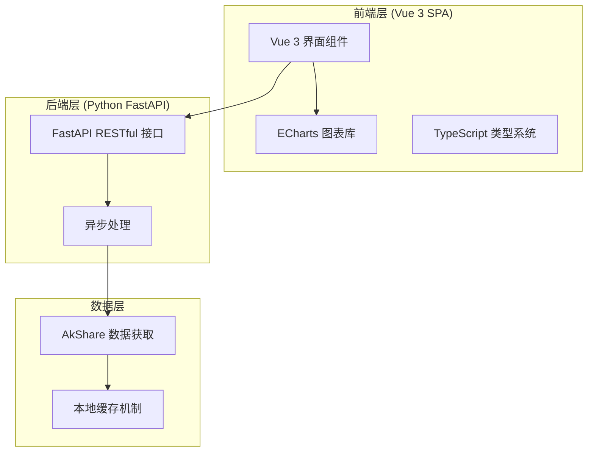
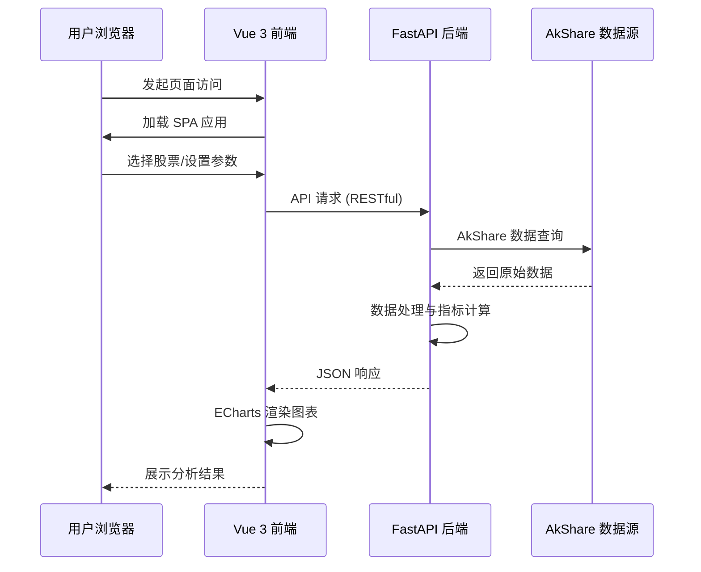

# Equity View 项目概述

## 1. 项目简介

Equity View 是一款个人使用的中国 A 股股票交易数据分析与可视化工具。该软件旨在帮助用户分析股票历史交易数据、计算技术指标，并以图表形式直观展示分析结果。

### 1.1 项目定位

- **使用场景**：纯个人投资分析工具
- **目标用户**：单人使用（开发者本人）
- **数据范围**：中国 A 股市场股票交易数据

## 2. 技术架构

### 2.1 整体架构图



### 2.2 技术选型

| 层级 | 技术栈 | 说明 |
|------|--------|------|
| **前端框架** | Vue 3 + `<script setup>` | 使用 Composition API，现代化语法糖 |
| **编程语言** | TypeScript | 提供类型安全和更好的开发体验 |
| **构建工具** | Vite | 快速的开发与构建体验 |
| **图表库** | Apache ECharts | 强大的金融数据可视化能力 |
| **后端框架** | Python FastAPI | 高性能异步 Web 框架 |
| **数据获取** | AkShare | 开源的中国金融市场数据接口库 |
| **项目类型** | SPA 单页应用 | 前后端分离架构 |

## 3. 功能范围

### 3.1 核心功能

- **股票数据查询**：通过 AkShare 获取中国 A 股历史交易数据
- **技术指标计算**：常用技术分析指标的计算（如 MA、MACD、KDJ 等）
- **图表可视化**：使用 ECharts 绘制 K 线图、成交量图、指标图等
- **数据对比分析**：多只股票的数据对比功能

### 3.2 非功能性需求

| 类型 | 要求 |
|------|------|
| **用户认证** | 不需要（纯个人使用） |
| **数据持久化** | 本地存储或临时缓存 |
| **部署方式** | 本地运行 |

## 4. 系统架构

### 4.1 前后端分离架构



### 4.2 目录结构规划

```
equity-view/
├── frontend/                  # 前端项目 (Vue 3 + TypeScript)
│   ├── src/
│   │   ├── components/       # Vue 组件
│   │   ├── views/            # 页面视图
│   │   ├── utils/            # 工具函数
│   │   ├── types/            # TypeScript 类型定义
│   │   └── api/              # API 接口调用
│   ├── public/               # 静态资源
│   └── package.json
├── backend/                   # 后端项目 (Python FastAPI)
│   ├── app/
│   │   ├── api/              # API 路由定义
│   │   ├── services/         # 业务逻辑服务
│   │   ├── models/           # 数据模型
│   │   └── utils/            # 工具函数
│   ├── tests/                # 单元测试
│   └── requirements.txt
├── project-docs/              # 项目文档
└── README.md
```

## 5. 开发规范

### 5.1 前端规范

- 使用 Vue 3 Composition API + `<script setup>` 语法
- 所有代码使用 TypeScript 编写
- 组件命名采用 PascalCase
- 文件命名采用 kebab-case
- 使用 ESLint + Prettier 进行代码格式化

### 5.2 后端规范

- Python 3.9+
- 使用 `conda activate base` 来激活 python 环境
- 使用 FastAPI 异步处理请求
- API 设计遵循 RESTful 规范
- 使用 Pydantic 进行数据验证
- 添加完善的错误处理机制

## 6. 后续扩展方向（可选）

- **更多技术指标**：扩展布林带、RSI、KLine 等指标
- **自定义图表配置**：允许用户保存个性化的图表样式
- **数据导出功能**：支持将分析结果导出为图片或 PDF
- **盘前/盘中数据**：集成实时行情数据接口

## 7. 版本历史

| 版本 | 日期 | 说明 |
|------|------|------|
| v1.0 | 2026-03-13 | 项目初始化，制定技术架构与文档规范 |
