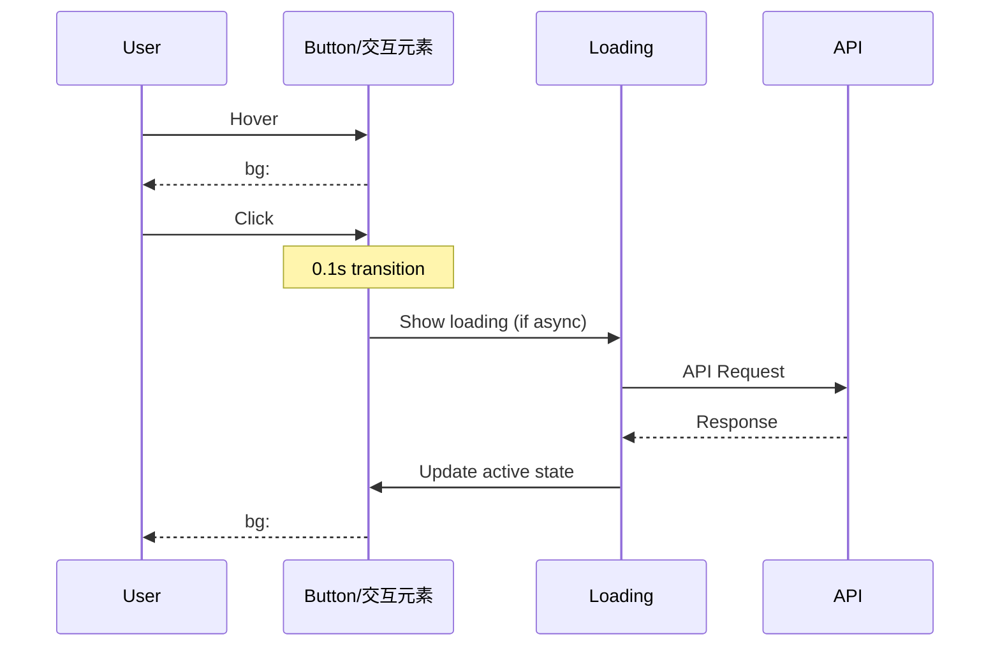
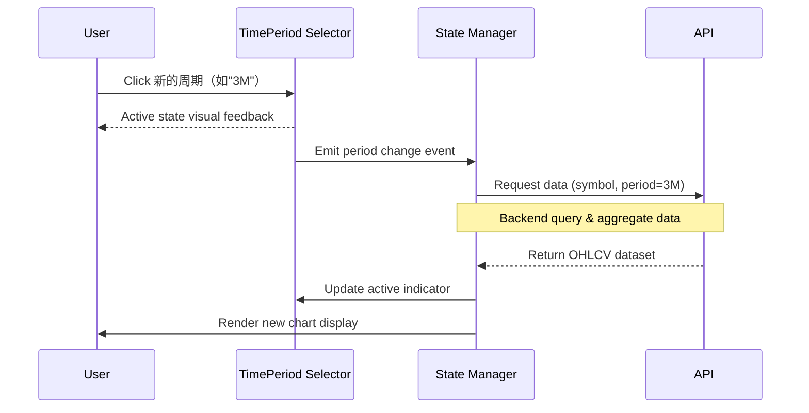

# Equity View 页面框架功能设计文档

**文档状态**: 初版
**更新日期**: 2026-03-13
**设计参考**: TradingView 股票图表平台

---

## 1. 概述

本文档定义 Equity View 应用的主页面框架结构及主要操作区域。页面框架是用户与系统进行交互的核心载体，采用 **深色主题（Dark Theme）**设计风格，布局参考 TradingView，为用户提供专业的股票数据分析体验。

**注意**: 图表绘制区的具体功能设计不在本文档范围内，将在专门的图表功能文档中详述。

---

## 2. 页面框架整体架构

### 2.1 页面布局结构

```
+======================================================================+
|                         顶部工具栏 (Toolbar)                          |
|  [Logo] [股票代码] [时间周期] [图表类型] [...]      [Trade][Settings]|
+======================================================================+
|                                                                      |
|  +----------------------------------------------------------------+  |
|  |                                                               |  |
|  |                      K 线图主体区域                            |  |
|  |                  (ECharts 图表渲染区)                           |  |
|  |                                                               |  |
|  +----------------------------------------------------------------+  |
|  |                    成交量柱状图区域                             |  |
|  +----------------------------------------------------------------+  |
+======================================================================+
|                                                                      |
|                          底部时间选择器                               |
|            [1D] [5D] [1M] [3M] [6M] ...                              |
+======================================================================+
```

### 2.2 区域划分说明

| 序号 | 区域名称 | 功能定位 | 占比 |
|------|----------|----------|------|
| 1 | 顶部工具栏 | 全局操作入口，股票选择、视图控制 | ~50px |
| 2 | K 线图主体区 | 核心图表显示区域（图表设计见专用文档） | ~60% |
| 3 | 底部时间选择器 | 快速时间周期切换 | ~80px |
| 3 | 成交量图区 | 成交量数据可视化（图表设计见专用文档） | ~15% |
| 4 | 底部时间选择器 | 快速时间周期切换、当前时间点显示 | ~80px |

---

## 3.3 工具栏布局顺序（从左到右）

```
[Logo] → [股票选择框] → [时间周期区] → [图表类型] → [Indicators]
→ [视图切换] → [Undo/Redo] → [Screenshot/Zoom] → [Settings]
```

---


## 3. 顶部工具栏功能区

### 3.1 功能模块定义

```mermaid
graph LR
    A[顶部工具栏 Toolbar] --> B1[应用标识区]
    A --> B2[股票选择区]
    A --> B3[时间周期区]
    A --> B4[图表类型区]
    A --> B5[指标控制区]
    A --> B6[视图切换区]
    A --> B7[工具操作区]
    A --> B8[状态显示区]
    A --> B9[用户功能区]
    A --> B10[主操作按钮区]

    style B2 fill:#2a2e39
    style B10 fill:#2962FF,color:#fff
```



### 3.2 各功能模块详细说明

#### 3.2.1 应用标识区（最左侧）

| 属性 | 值 |
|------|-----|
| 内容 | "Equity View" |
| 样式 | H2 字号 20px, font-weight:600 |
| 颜色 | #D1D4DC (主文字色) |
| 内边距 | 8px 16px |

#### 3.2.2 股票选择区（核心交互区）

**位置**: 应用标识区右侧
**背景色**: #1e222d (面板背景)

##### 组件结构

```
┌─────────────────────┬─────────┐
│   600226            │ ▼       │  ← 股票代码下拉框
├─────────────────────┼─────────┤
│ Zhejiang Hengtong...| [搜索]  │  ← 显示公司名 + 搜索按钮
└─────────────────────┴─────────┘
```

##### 功能要求

- **股票代码输入**: 支持手动输入 6 位数字代码（如"600226"）
- **自动填充**: 输入时提供股票代码和名称的实时搜索建议
- **下拉选择**: 点击下拉箭头从自选列表中快速切换股票
- **显示信息**:
  - 第一行：当前查看的股票代码，字体大小 14px
  - 第二行：公司全称（截断显示），字体大小 12px

##### 交互状态

| 状态 | 表现 |
|------|------|
| 默认 | 背景色 #1e222d, 边框 1px solid #2a2e39 |
| 聚焦 | 边框高亮 #2962FF |
| 悬停 | 背景色变亮至 #2a2e39 |

#### 3.2.3 时间周期选择区

**位置**: 股票选择区右侧
**交互方式**: 选项卡组（Tabs）

##### 可用周期选项

| 标识 | 说明 | 显示文本 |
|------|------|----------|
| D | 日线 | "D" |
| W | 周线 | "W" |
| M | 月线 | "M" |
| 3M | 近 3 个月 | "3M" |
| 6M | 近 6 个月 | "6M" |
| YTD | 年初至今 | "YTD" |
| 1Y | 近 1 年 | "1Y" |
| 5Y | 近 5 年 | "5Y" |
| All | 全部数据 | "All" |

##### 样式规范

```css
/* 默认状态 */
background: transparent;
color: #787B86;
padding: 4px 8px;
border-radius: 3px;

/* 悬停状态 */
background: #2a2e39;
color: #D1D4DC;

/* 激活状态 */
background: #2a2e39;
color: #FFFFFF;
font-weight: 500;
```

#### 3.2.4 图表类型切换区

**位置**: 时间周期选择区右侧
**交互方式**: 图标按钮组

##### 可用图表类型

| 序号 | 类型 | 图标说明 | 功能描述 |
|------|------|----------|----------|
| 1 | K 线图（默认） | 🕯️ | 蜡烛图显示，含 OHLC 数据 |
| 2 | 折线图 | 📈 | 收盘价连线图 |
| 3 | 柱状图 | ▂▃▄ | 开盘/收盘价对比柱状 |
| 4 | 面积图 | ⬛ | 带填充的折线图 |

#### 3.2.5 指标控制区

**位置**: 图表类型切换区右侧
**交互方式**: 下拉菜单触发器

##### 功能说明

- **标签文本**: "Indicators"
- **点击行为**: 弹出技术指标选择列表
- **可添加指标**（扩展功能）:
  - MA / Moving Average（移动平均线）
  - MACD（指数平滑异同移动平均线）
  - RSI（相对强弱指标）
  - KDJ（随机指标）
  - Bollinger Bands（布林带）

#### 3.2.6 视图切换区

**位置**: "Indicators"按钮右侧
**图标描述**: 多图表布局切换图标

##### 功能说明

- **单图表模式**: 默认显示主图 + 成交量
- **双图表模式**: 上下分割，同时查看不同周期或指标
- **四图表模式**: 2x2 网格，最多对比四个视图

#### 3.2.7 工具操作区

**位置**: 视图切换区右侧

##### 可用工具

| 图标 | 功能 | 说明 |
|------|------|------|
| ↩️ | Undo | 撤销上一步操作 |
| ↪️ | Redo | 重做上一步操作 |
| 📐 | Drawing Tools | 绘图工具集（趋势线、斐波那契等） |
| 🔔 | Alerts | 价格提醒设置 |
| ▶️ | Replay | K 线回放功能 |

#### 3.2.8 应用状态显示区

**位置**: 工具操作区右侧
**显示内容**: "Unnamed"（当前分析配置名称）

##### 交互行为

- **悬停提示**: 显示保存、加载、重命名配置选项
- **点击行为**: 弹出配置管理菜单

#### 3.2.9 用户功能区（最右侧）

**位置**: 工具栏右端，主操作按钮左侧

##### 功能图标组

| 图标 | 功能 | 说明 |
|------|------|------|
| 📷 | Screenshot | 截图保存当前图表视图 |
| 🔍 | Zoom | 图表缩放控制 |
| ⚙️ | Settings | 应用设置入口 |
| 👤 | User Profile | 用户信息/配置同步 |

#### 3.2.10 视图操作按钮区（最右侧）

**位置**: 工具栏右端，用户功能区左侧

##### 功能图标组

| 图标 | 功能 | 说明 |
|------|------|------|
| 📷 | Screenshot | 截图保存当前图表视图 |
| 🔍 | Zoom In/Out | 图表缩放控制 |
| ⚙️ | Settings | 应用设置入口 |

---

## 4. K 线图主体区域

### 4.1 区域定义

**位置**: 页面中心主显示区，顶部工具栏下方
**视觉占比**: 约占据视口高度的 60%
**背景色**: #131722（最暗背景）

> **说明**: 图表绘制逻辑、K 线渲染细节、十字准星交互等功能详见《图表功能设计文档》。本文档仅定义区域框架和基本信息显示位置。

### 4.2 股票信息栏（左上角固定区域）

```
┌─────────────────────────────────────────────────────┐
│ Zhejiang Hengtong Holding Co., Ltd · D · SSE       │
│ O5.48 H6.02 L5.40 C6.02 +0.55 (+10.05%)            │
└─────────────────────────────────────────────────────┘
```

#### 显示规范

| 行号 | 内容 | 格式说明 |
|------|------|----------|
| 1 | 公司全称 · D · SSE | [公司名称] · [当前周期] · [交易所代码] |
| 2 | O5.48 H6.02 L5.40 C6.02 +0.55 (+10.05%) | OHLC 数据 + 涨跌幅 |

#### 样式规则

```css
/* 第一行 - 公司信息 */
font-size: 14px;
color: #D1D4DC;
separator-color: #787B86; /* ·分隔符颜色 */

/* 第二行 - OHLC 数据 */
font-size: 12px;
color: #D1D4DC;
up-color: #089981; /* 上涨显示青色 */
down-color: #F23645; /* 下跌显示红色 */
```

#### OHLC 字段说明

| 字段 | 全称 | 说明 |
|------|------|------|
| O | Open | 开盘价 |
| H | High | 最高价 |
| L | Low | 最低价 |
| C | Close | 收盘价（当前价） |
| +/-X.XX | Change (Absolute) | 涨跌绝对值 |
| (+/-XX.XX%) | Change (Percent) | 涨跌幅百分比 |

---

## 4.3 K 线图价格刻度（右侧 Y 轴）

**位置**: K 线图右侧垂直显示

##### 样式规则

- **字体大小**: 11-12px
- **文字颜色**: #787B86（次文字色）
- **对齐方式**: 右对齐或居中对齐
- **格式**: 保留两位小数，如 "6.02"

---

## 5. 成交量图区域

### 5.1 区域定义

**位置**: K 线图主体区域正下方
**视觉占比**: 约占据主显示区高度的 15%
**对齐方式**: 与上方 K 线严格垂直对齐

### 5.2 功能说明

- **数据展示**: 每日成交量柱状图
- **颜色规则**:
  - 上涨日（收盘价 > 开盘价）：#089981（半透明，透明度 0.6）
  - 下跌日（收盘价 < 开盘价）：#F23645（半透明，透明度 0.6）
- **鼠标悬停**: 显示当日成交量具体数值

---

## 6. 底部时间选择器区域

### 6.1 区域结构

```
+======================================================================+
| [   1D   ][   5D   ][   1M   ][   3M   ][   6M   ][    YTD   ]      |
|                                                                          |
| [     1M      ][     3M     ][     6M     ][      1Y      ] [...]    ← 可横向滚动扩展选项
+======================================================================+
│ Last update at: 2026-03-13 15:00 (UTC+8)                  [ADJ ▼]     │ ← 状态栏
+======================================================================+
```

### 6.2 时间周期选择器

#### 可选周期列表（可滚动）

| 标识 | 说明 | 显示文本 |
|------|------|----------|
| 1D | 最近 1 天 | "1D" |
| 5D | 最近 5 天 | "5D" |
| 1M | 最近 1 个月 | "1M" |
| 3M | 最近 3 个月 | "3M" |
| 6M | 最近 6 个月 | "6M" |
| YTD | 年初至今 | "YTD" |
| 1M | 最近 1 年 | "1Y" |
| 3M | 最近 3 年 | "3Y" |
| 5Y | 最近 5 年 | "5Y" |
| All | 全部历史数据 | "All" |

#### 布局规则

- **每行显示**: 约 6-8 个周期选项，超出部分横向滚动
- **激活指示器**: 选中项加粗显示，并带底边高亮条（#2962FF）

### 6.3 底部状态栏

**位置**: 时间选择器下方，通栏显示

| 元素 | 说明 | 样式 |
|------|------|------|
| 更新时间 | "Last update at: YYYY-MM-DD HH:mm (UTC+X)" | font-size:12px, color:#787B86 |
| ADJ 切换按钮 | [ADJ ▼] | 悬浮数据调整模式，font-size:12px |

#### ADJ（Adjustment）模式说明

| 模式 | 说明 |
|------|------|
| Adj Close | 复权收盘价（前复权/后复权） |
| Unadjusted | 未调整原始数据 |

---

## 7. 响应式布局规则

### 7.1 断点定义

| 断点名称 | 宽度范围 | 布局策略 |
|----------|----------|----------|
| XL/Desktop | ≥1440px | 标准桌面布局，三栏全显 |
| LG/Tablet | 1024-1439px | 适当压缩间距，侧边栏可收起 |
| MD/Mobile | 768-1023px | 隐藏非核心工具按钮，简化顶部导航 |
| SM/Phone | <768px | 垂直堆叠布局，仅保留核心功能 |

### 7.2 各断点适配策略

#### XL/Desktop (≥1440px)
- 完整显示所有工具栏按钮
- 侧边栏固定显示（如扩展）
- K 线图区域最大化利用空间

#### LG/Tablet (1024-1439px)
- 合并部分次要图标按钮为下拉菜单
- 侧边栏可折叠开关
- 时间选择器单行显示关键选项

#### MD/Mobile (768-1023px)
- 隐藏绘图工具、Alert 等次级功能
- 只显示股票选择、时间周期、主操作按钮
- K 线图区域高度增加至约 70%

#### SM/Phone (<768px)
- **顶部导航简化**:
  - Logo + 股票代码下拉框合并为折叠菜单
  - 时间周期移至底部常驻
  - 图表类型切换为图标快捷按钮
- **K 线图区域**: 占满整个视口高度
- **底部增强**: 时间选择器 + 关键指标快速查看

---

## 8. 组件状态映射表

### 8.1 工具栏按钮状态映射

| 元素 | 默认状态 | 悬停状态 | 激活/点击态 | 禁用状态 |
|------|----------|----------|-------------|----------|
| 股票选择框 | #1e222d + border | #2a2e39 | #2a2e39 + blue border | #0f1219 (灰化) |
| 时间周期 | text:#787B86 | bg:#2a2e39, text:#D1D4DC | bg:#2a2e39, text:#FFF, font:500 | opacity:0.3 |
| 图标按钮 | icon: #D1D4DC | bg:#2a2e39 | bg:#363a45 | icon: #565969 |
| Trade 主按钮 | bg:#2962FF | bg:#4a7dff | bg:#1e4bd1, scale:0.98 | bg:#565969 |

### 8.2 交互反馈时序



---

## 9. 数据结构定义

### 9.1 股票选择框数据结构

```typescript
interface StockInfo {
  code: string;          // 股票代码，如 "600226"
  name: string;          // 公司简称，如 "同花顺"
  fullName: string;      // 公司全称，如 "Zhejiang Hengtong Holding Co., Ltd"
  exchange: string;      // 交易所代码，如 "SSE" / "SZSE"
  sector?: string;       // 行业分类
}

interface ChartConfig {
  symbol: StockInfo;     // 当前股票信息
  period: TimePeriod;    // 时间周期
  chartType: ChartType;  // 图表类型
  indicators: Indicator[]; // 已加载技术指标列表
  scale: string;         // 缩放级别（可选）
}

type TimePeriod = 'D' | 'W' | 'M' | '3M' | '6M' | 'YTD' | '1Y' | '5Y' | 'All';
type ChartType = 'candlestick' | 'line' | 'bar' | 'area';

interface Indicator {
  id: string;            // 指标唯一标识，如 "ma_20"
  type: 'MA' | 'MACD' | 'RSI' | 'KDJ' | 'BB';
  params: Record<string, number>; // 参数配置
}
```

### 9.2 OHLCV 数据结构（图表数据来源）

```typescript
interface OHLCVData {
  date: string;          // 日期，ISO8601 格式 "YYYY-MM-DD"
  open: number;          // 开盘价
  high: number;          // 最高价
  low: number;           // 最低价
  close: number;         // 收盘价
  volume: number;        // 成交量（股数）
  adjusted?: boolean;    // 是否复权数据
}

interface PriceInfo {
  open: number;          // 开盘价
  high: number;          // 最高价
  low: number;           // 最低价
  close: number;         // 当前收盘价
  change: number;        // 涨跌绝对值
  changePercent: number; // 涨跌幅百分比
}

interface MarketStatus {
  isClosed: boolean;     // 市场是否收盘
  lastUpdateTime: string;// 最后更新时间
  timeZone: string;      // 时区，如 "UTC+8"
}
```

---

## 10. 关键交互流程

### 10.1 股票切换流程

```mermaid
flowchart TD
    A[用户点击股票代码下拉框] --> B{输入模式？}
    B -->|是 | C[显示搜索输入框]
    B -->|否 | D[显示自选列表]

    C --> E[实时搜索匹配]
    E --> F{找到结果？}
    F -->|是 | G[显示搜索结果候选列表]
    F -->|否 | H[显示"无搜索结果"]

    G --> I[用户选择股票]
    D --> I
    I --> J[API 请求新股票数据]
    J --> K{请求成功？}
    K -->|是 | L[更新页面数据显示]
    K -->|否 | M[显示错误提示 + 重试按钮]

    style J fill:#e1f5ff
    style L fill:#c8e6c9
    style M fill:#ffcdd2
```

### 10.2 时间周期切换流程



---

## 11. 性能要求

### 11.1 页面加载性能

| 指标 | 目标值 | 说明 |
|------|--------|------|
| 首屏渲染时间 (FCP) | < 1.5s | 首次内容绘制 |
| 可交互时间 (TTI) | < 3s | Time to Interactive |
| API 响应延迟 | < 500ms (95th percentile) | 股票数据查询接口 |

### 11.2 图表渲染性能

| 指标 | 目标值 | 说明 |
|------|--------|------|
| K 线图初始化绘制时间 | < 300ms | 首屏加载 |
| 周期切换响应时间 | < 200ms | 点击周期到图表更新完成 |
| 缩放/平移延迟 | < 50ms | 保证流畅交互 |

### 11.3 优化策略

- **数据懒加载**: 仅请求当前可视范围内的数据
- **缓存机制**: 本地缓存历史查询结果（localStorage）
- **虚拟滚动**: 大批量 K 线数据时分段渲染
- **防抖节流**: 周期切换、缩放操作添加延迟保护

---

待确认事项：无（交易相关功能已全部移除）

## 13. 后续关联文档

| 序号 | 文档类型 | 文件名 | 主题 |
|------|----------|--------|------|
| 1 | 功能设计文档 | `feat-chart-draw.md` | K 线图/图表绘制交互功能 |
| 2 | 功能设计文档 | `feat-indicator-calc.md` | 技术指标计算逻辑（MA/MACD/RSI） |
| 3 | API 接口文档 | `api-stock-query.md` | 股票数据查询接口定义 |
| 4 | 静态 HTML 原型 | `static-html/frame-v1.html` | 页面框架线框图 |

---

## 14. 版本历史

| 版本 | 日期 | 修改说明 | 修改人 |
|------|------|----------|--------|
| v1.0.1 | 2026-03-13 | 移除 BUY/SELL 标签和交易相关功能（Trade 按钮） | - |
| v1.0.0 | 2026-03-13 | 初版发布，定义页面框架及主要操作区域 | - |

**移除内容**:
- BUY/SELL 价位标签区（原第 4.3 节）
- Trade 主操作按钮
- Backtest（回测）功能入口

---

**文档结束**
